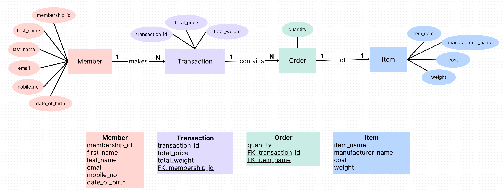
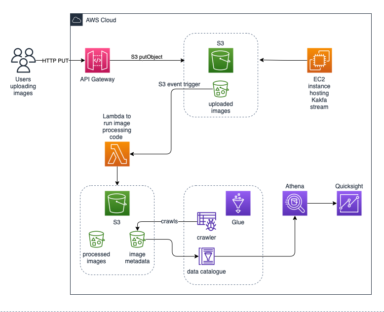
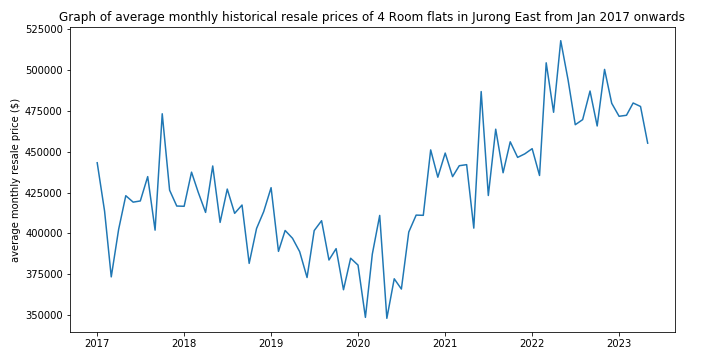

# SECTION 1
- every one hour, the scheduler first fetches datasets (currently from github) and places them into an existing folder `raw-datasets`, to mimick the process of dropping the applications datasets into the source folder.
- The dropping will trigger the pipeline (which does the ingestion from source folder, processing, and outputting into processed-/faulty-datasets folders) to run. 
- In AWS where we can use S3 buckets as the folders, we can set up EventBridge to listen for the event of adding datasets into the folder, which will then trigger the pipeline to start running. The pipeline can be implemented simply as a lambda function or as a StepFunction if we want to scale it up.

---
# SECTION 2
## ER diagram
---

The following assumptions are made when coming up with this design:

* `total_price` and `total_weight` are not calculated using data stored in the tables `orders` and `items`, but are readily available when a transaction is made
* `item_name` is unique and can be used as primary key to distinguish the different items

## Executing the codes
---
This section requires the Postgres Docker Official Image which can be installed by running ```docker pull postgres``` in the terminal.

Build and run the Dockerfile in this root directory (i.e. parent directory of `Section-2`) using the following commands.
```
docker build -t postgres-db -f Section-2/Dockerfile .

docker run --name postgres-db-container -p 5432:5432 -d postgres-db
```

To run the queries,
```{bash}
cd Section-2/queries

cat query_1.sql | docker exec -i postgres-db-container psql -U postgres -d database

cat query_2.sql | docker exec -i postgres-db-container psql -U postgres -d database
```

---
# Section 3


## Architecture Details
---
**1. Ingestion**

In the information given, images are uploaded to the cloud from 2 sources, namely a user-facing web application via an API, and another web application hosting a self-managed Kafka stream. We choose to store images from both sources in the same S3 bucket, so that we can process them together.

The first web application will use the API Gateway to upload the images into the bucket. We use an EC2 instance to run the second web application where we host the Kafka stream as we want the Kafka stream to be self-managed.

**2. Processing**

We can run the image processing code using AWS Lambda as the computing platform, as it is serverless and can be event driven, where we can configure EventBridge to trigger the lambda function whenever new files are uploaded into the S3 bucket. The processed images will then be stored in a S3 bucket for other use cases.

Assuming that the image processing code will also output the images' metadata as json files, we can save the metadata information in another S3 bucket, which we can then use Glue crawlers to crawl and catalogue it.

**3. Business Intelligence**

We can use Athena to query and analyse the images' metadata using the data catalogue created by the Glue crawler. For visualisation of the results from Athena, we can use Quicksight by connecting it to Athena.

**4. Purging of images and metadata from cloud**

We can configure S3 Lifecycle policy for the 3 buckets in the system to permanently delete the objects after 7 days.

---
# Section 4
> **_NOTE:_** This section follows the details in https://github.com/ameeraadam/DETechAssessment-23/tree/fix/section_4 as the APIs from https://documenter.getpostman.com/view/10808728/SzS8rjbc#b07f97ba-24f4-4ebe-ad71-97fa35f3b683 and https://covid19api.com/ cannot be accessed.



---
# Section 5
The following models are tested for this classification task:

* Naive Bayes
* SVM
* Decision Tree
* Random Forest

Although the accuracy of all models are still currently less than ideal, Naive Bayes gave the best results out of all of them, so prediction is made with this model.

The predicted value of `buying` is `low`, given the parameters `maint=high, doors=4, lug_boot=big, safety=high, class=good`.